ArtyFX Manual
==============
Welcome to the manual for
[ArtyFX](http://www.openavproductions.com/artyfx),
where we'll discuss what each plugin in the ArtyFX
suite is designed for, and where they can be abused to create even cooler audio!

[OpenAV Productions](http://www.openavproductions.com) has created these
plugins during free time, if you like them make a small contribution to
the project - its great to get feedback from the community :)
[OpenAV Release System](http://www.openavproductions.com/support),

Introduction
------------
ArtyFX contains many different plugins: all in one bundle. These are
[LV2](http://www.lv2plug.in/) plugins,
which means that they will work in an LV2 compatible host like
[Ardour](http://www.ardour.org) and
[QTractor](http://www.qtractor.sf.net).
If you want to use the effects as a standalone program,
[Jalv](http://drobilla.net/software/jalv/) is designed for that!

To test plugins, we reccommend using Jalv. Eg:
```
jalv.gtk http://www.openavproductions.com/artyfx#roomy
```


Show me the plugins!
--------------------
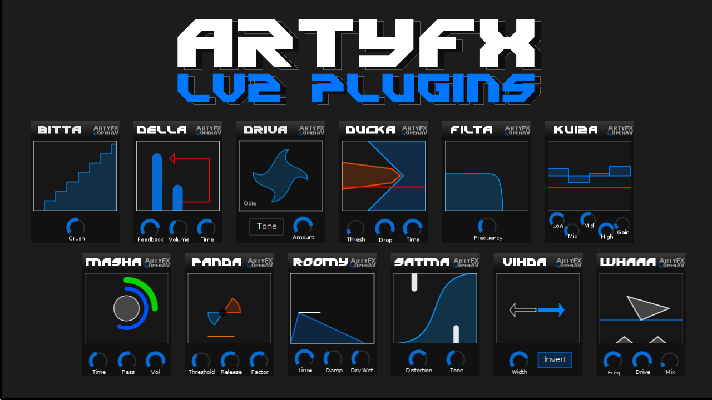
ArtyFX is a growing suite of plugins: right now, the following plugins are
available:
```
- Bitta    (Bitcrusher)
- Della    (Delay)
- Driva    (Guitar Distortion)
- Ducka    (Sidechain envelope)
- Driva    (Heavy distortion)
- Filta    (Low/Hi- pass filter)
- Kuiza    (4- band EQ)
- Masha    (Beat grinder)
- Panda    (Compressor / Expander)
- Roomy    (Smooth reverb)
- Satma    (Crazy distortion)
- Vihda    (Stereo Widener)
```

Bitta
-----
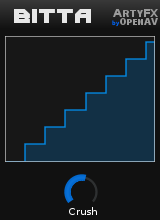
Bitta is a bit-crusher, with a wet dry control.
```
-Crush
-Dry/Wet
```

Crush changes the amount of bits the audio is reduced to, turn it up for more
genuine hip-hop drum crunch.

The Dry/Wet control allows blending of the crushed signal with the original:
useful to maintain punch, but add a nice amount of grit.

Note that bitcrushing is a process that is dependant on the volume of a signal,
so check that your levels are good! Quite signals are silence when bitcrushed!

Driva
-----

Driva is a multi-distortion unit capable of the most mean and gritty
distortions.
```
-Tone
-Amount
```

Click the Tone button, a list of different distortion models are available.
Just click the desired distortion, and keep rocking out. Cancel at the
bottom quits the tone-change view.

Amount just cranks up the gain / distortion quanitity. Use at your own
peril!

Della
-----
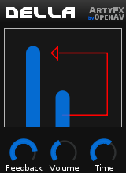
Della is a BPM adjusting delay, with 3 controls:
```
- Feedback
- Volume
- Time
```

Feedback controls the amount of the signal fed back into the delay line: turn 
it up to have that reggae crazy- dub echo that goes on forever!

Volume changes the amount of the delayed signal you hear: useful to keep the 
delays in the background of a track.

Time changes the delay-length: note that this is "quantized" to multiples of 
the BPM, so it "jumps" between a 1/8th note, 1/4 note, 1/2 note and whole note 
duration. Della picks up the BPM from the host program: so if you change tempo 
it will continue to stay in time!


Ducka
-----
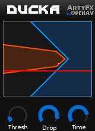
Ducka is a side- chain envelope plugin: it is very useful for creating "pumping"
basslines as often found in minimal house music. The plugin works by analysing
the volume of a sidechain input, and changing the volume of a seperate
stereo track, based on the amplitude of the sidechain input.

Eg: if there's a kick-drum on the sidechain input, the volume of the stereo
track gets reduced, until the kickdrum is over, then the stereo track is faded
in again. The controls:
```
- Threshold
- Drop
- Time
```

Threshold sets the level that the input audio must reach before the stereo track
gets reduced.

The drop controls the amount of volume reduction that is performed.

Time controls the amount of time it take before the stereo track is faded in 
again. Note that this control is BPM dependant, and the center is directly on 
the off- beats. A setting of half (its default) is generally musical :)

Driva
-----

Driva is a heavy distortion designed for electric guitar, but it will bring to
life any synth of drum-loop you want to crunch and give extra energy.
The controls:
```
- Tone
- Amount
```

Tone changes the type of distortion internally; there are 2 waveshapers and an
equalizer that are arranged in different ways to achieve different tone flavours.

Amount controls the level of distortion that occurs.


Filta
-----
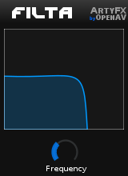
Filta is a lowpass and highpass filter combination. Useful to remove unwanted
high and low frequencies from various recordings or instruments.
The controls:
```
- Frequency
```
Frequency controls what type of filtering is done, and what frequency. Lower
values are lowpass filter, turning up the dial is causes highpass.


Kuiza
-----
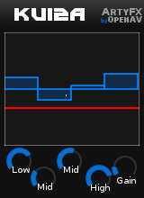
Kuiza is a 4 band equalizer. Its perfect for creatively shaping the sound of an
instrument or synth.
The controls (left to right):
```
- Low gain     (   ~55 Hz)
- Low mid gain (  ~220 Hz)
- High mid gain( ~1760 Hz)
- High gain    ( ~7040 Hz)
- Master gain
```

Each of the gain controls changes the amplitude at the given frequency.
The master gain can be used to reduce or amplify the overall volume if needed.


Masha
-----
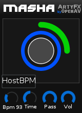
Masha is a beat grinder plugin: it records a segement of audio and plays it
back as a loop, causing a "stutter" effect.
The controls are:
```
- Volume
- PassThru
- Time
```

Volume changes the loudness of the stutter-loop.
PassThru allows bleeding the normal signal trough.
Time is a BPM dependant control that changes the loop-record and playback length.
Gradually reduce this value to get that "standard" DJ stutter effect!


Panda
-----
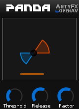
Panda is a compressor expander combo, with attack and release controls.
```
-Threshold
-Attack
-Release
-Factor
```

Threshold: the "turning point" of compression / expansion. Turning down the dial
expands the signal, turning up causes compression.

Attack affects the speed at which the compression/expansion starts. Generally 
low settings sound good, unless you need a long attack.

Release changes the time for Panda to fade-out its compression/expansion.

Factor controls the amount of compression/expansion performed, AKA the "maximizer" dial.


Roomy
-----
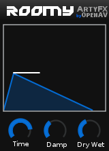
Roomy is a spacious and smooth reverb. It has three controls:
```
- Time
- Damping
- Dry / Wet
```

The time control changes the length of the reverb tail: higher values give will
create a bigger and more spacious mix.

Damping controls the high- frequency damping: lower settings gives a spacious
open sound, while a high damping feels small and close.

The Dry/Wet control changes the amount of reverb signal mixed in: useful for
techno and trance "reverb builds"... just crank it right up!


Satma
-----
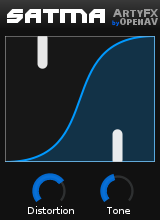
Satma is a crazy distortion plugin. Useful to excite and get gritty, dirty audio.
```
- Distortion
- Tone
```

Distortion changes the amount of signal- shaping that occurs: the overall
amount of noise production.

The tone control subtly varies between high-frequencies and lower frequencies,
or making both equally gritty.


Vihda
-----
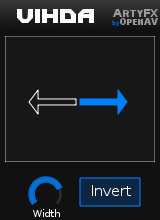
Vihda is a stereo-enhancer, using a mid-side matrix.
```
- Width
- Invert
```

The width parameter affects the amount of stereo content in the signal. Note that
the the mid-side technique only enhances stereo: it does not create it!

The invert button inverts the right channel, which can cause a perceptual wider 
mix due to how the brain interprets audio. Try it and see if it sounds good.


Outro
------
Do you have a plugin suggestion for ArtyFX? Get in contact with
[OpenAV](http://www.openavproductions.com/contact)!

You can financially support OpenAV and the ArtyFX plugins here:
[Support OpenAV](http://www.openavproductions.com/support)!

I hope you enjoy using these plugins!
  - Harry van Haaren, OpenAV

